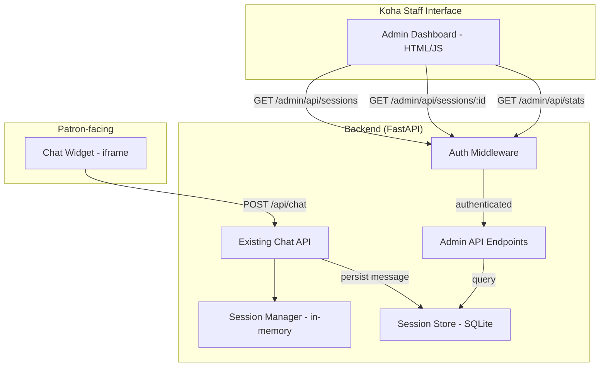

# Design Document: Admin Chat Monitoring

## Overview

The Admin Chat Monitoring feature adds a staff-facing dashboard and supporting backend infrastructure to the existing Library AI Chatbot. It enables library staff to monitor patron-chatbot conversations in near real-time, review historical sessions, and view aggregate usage statistics.

The feature introduces three main additions:

1. **Persistent Session Store** — A SQLite-backed storage layer that persists chat messages independently of the in-memory `SessionManager`, so conversations survive session expiry and server restarts.
2. **Admin API** — A set of authenticated REST endpoints that serve session data (list, detail, statistics) to the dashboard.
3. **Admin Dashboard** — A static HTML/JS page served by the backend that provides session list, detail, and statistics views.

Authentication uses a shared API key read from an environment variable, passed via request header.

## Architecture



### Request Flow — Message Persistence

1. Patron sends a message via `POST /api/chat` (existing flow).
2. The chat endpoint processes the message as before (classify → handle → respond).
3. After storing messages in the in-memory `SessionManager`, the endpoint also persists both the patron message and the chatbot response to the `SessionStore` (SQLite).
4. If the `SessionStore` write fails, the error is logged and the patron response is returned normally (graceful degradation).

### Request Flow — Admin Dashboard

1. Staff user navigates to `/admin/` which serves the static dashboard HTML.
2. Dashboard JS makes API calls to `/admin/api/sessions`, `/admin/api/sessions/{id}`, and `/admin/api/stats`.
3. Each request includes the API key in the `X-Admin-Key` header.
4. The `auth_dependency` validates the key; returns 401 if missing or invalid.
5. Admin API queries the `SessionStore` and returns JSON.

## Components and Interfaces

### 1. Session Store (`app/session_store.py`)

SQLite-backed persistent storage for chat sessions and messages.

- Uses a single SQLite file at a configurable path (env var `SESSION_DB_PATH`, default `data/sessions.db`).
- Two tables: `sessions` and `messages`.
- Provides methods: `save_message()`, `get_sessions()`, `get_session()`, `get_stats()`, `search_sessions()`.
- All database operations are synchronous (SQLite) but wrapped for async compatibility using `run_in_executor`.
- Handles database errors gracefully — logs and raises, letting callers decide on fallback behavior.

### 2. Admin Auth (`app/admin_auth.py`)

FastAPI dependency that validates the `X-Admin-Key` header against the configured API key.

- Reads expected key from `ADMIN_API_KEY` environment variable.
- Returns 401 with descriptive error for missing or invalid keys.
- Used as a dependency on all admin API routes.

### 3. Admin API Router (`app/admin_routes.py`)

FastAPI `APIRouter` mounted at `/admin/api` with three endpoints:

**GET /admin/api/sessions**
- Query params: `page` (default 1), `page_size` (default 20), `status` (optional: "active" | "expired"), `search` (optional keyword)
- Returns paginated session list with summary metadata.

**GET /admin/api/sessions/{session_id}**
- Returns full message history and metadata for a single session.
- Returns 404 if session not found.

**GET /admin/api/stats**
- Returns aggregate statistics: total sessions, total messages, active count, expired count.

### 4. Admin Dashboard (`app/static/admin.html`)

Single-page static HTML/JS dashboard served at `/admin/`.

- Session list view with pagination, status filter, and keyword search.
- Session detail view showing full transcript with role styling and timestamps.
- Statistics summary panel at the top of the main page.
- Loading indicators during API calls.
- Error messages when API calls fail.
- Semantic HTML with accessible labels.

### 5. Integration with Existing Chat Endpoint

The existing `POST /api/chat` endpoint in `app/main.py` is modified to:

- After `session_mgr.add_message(...)` calls, also call `session_store.save_message(...)` for both the user message and the assistant reply.
- Wrap the persistence call in a try/except so failures don't affect the patron response.

## Data Models

### Database Schema

```sql
CREATE TABLE IF NOT EXISTS sessions (
    session_id TEXT PRIMARY KEY,
    created_at REAL NOT NULL,
    last_activity REAL NOT NULL,
    message_count INTEGER NOT NULL DEFAULT 0
);

CREATE TABLE IF NOT EXISTS messages (
    id INTEGER PRIMARY KEY AUTOINCREMENT,
    session_id TEXT NOT NULL,
    role TEXT NOT NULL,          -- 'user' or 'assistant'
    content TEXT NOT NULL,
    timestamp REAL NOT NULL,
    FOREIGN KEY (session_id) REFERENCES sessions(session_id)
);

CREATE INDEX IF NOT EXISTS idx_messages_session ON messages(session_id);
CREATE INDEX IF NOT EXISTS idx_sessions_last_activity ON sessions(last_activity);
```

### Pydantic Models (additions to `app/models.py`)

```python
class MessageRecord(BaseModel):
    """A single persisted message."""
    role: str               # "user" or "assistant"
    content: str
    timestamp: float        # Unix timestamp

class SessionSummary(BaseModel):
    """Summary of a chat session for the list view."""
    session_id: str
    created_at: float
    last_activity: float
    message_count: int
    status: str             # "active" or "expired"

class SessionDetail(BaseModel):
    """Full chat session with message history."""
    session_id: str
    created_at: float
    last_activity: float
    message_count: int
    status: str
    messages: list[MessageRecord]

class SessionListResponse(BaseModel):
    """Paginated list of session summaries."""
    sessions: list[SessionSummary]
    total: int
    page: int
    page_size: int

class SessionStatsResponse(BaseModel):
    """Aggregate session statistics."""
    total_sessions: int
    total_messages: int
    active_sessions: int
    expired_sessions: int
```

### Session Status Determination

A session is "active" if `time.time() - last_activity < SESSION_TIMEOUT` (30 minutes), otherwise "expired". This is computed at query time, not stored.


## Correctness Properties

*A property is a characteristic or behavior that should hold true across all valid executions of a system — essentially, a formal statement about what the system should do. Properties serve as the bridge between human-readable specifications and machine-verifiable correctness guarantees.*

### Property 1: Message persistence round-trip

*For any* session ID and any sequence of (role, content) message pairs saved to the SessionStore, retrieving the session detail should return all messages with matching role and content in the same order they were saved.

**Validates: Requirements 1.1, 4.3**

### Property 2: Persisted message structure invariant

*For any* message saved to the SessionStore, the stored record should contain a non-empty role (either "user" or "assistant"), non-empty content, and a positive numeric timestamp.

**Validates: Requirements 1.2, 1.4**

### Property 3: Session list ordered by most recent activity

*For any* set of sessions in the SessionStore, the session list endpoint should return sessions in descending order of last_activity (most recent first).

**Validates: Requirements 2.1**

### Property 4: Session metadata completeness

*For any* session returned by the list or detail endpoint, the response should include session_id (non-empty string), created_at (positive number), last_activity (positive number), message_count (non-negative integer), and status (either "active" or "expired").

**Validates: Requirements 2.2, 3.4**

### Property 5: Status filter correctness

*For any* set of sessions in the SessionStore and a status filter value ("active" or "expired"), all sessions returned by the filtered list endpoint should have a status matching the filter value.

**Validates: Requirements 2.4, 3.3**

### Property 6: Keyword search returns matching sessions

*For any* set of sessions in the SessionStore and a non-empty search keyword that appears in at least one message, the search endpoint should return only sessions that contain at least one message whose content includes the keyword.

**Validates: Requirements 2.5**

### Property 7: Messages in chronological order

*For any* session detail response containing two or more messages, each message's timestamp should be less than or equal to the next message's timestamp.

**Validates: Requirements 3.1**

### Property 8: Pagination respects page size

*For any* valid page number and page size, the session list endpoint should return at most page_size sessions, and the total field should reflect the actual total number of matching sessions in the store.

**Validates: Requirements 4.2**

### Property 9: Non-existent session returns 404

*For any* session ID that does not exist in the SessionStore, the session detail endpoint should return a 404 status code with a JSON body containing an error field.

**Validates: Requirements 4.4**

### Property 10: Authentication gate

*For any* admin API endpoint, a request with a missing or incorrect API key should return 401, and a request with the correct API key should not return 401.

**Validates: Requirements 5.1, 5.2, 5.4, 5.5**

### Property 11: Statistics accuracy

*For any* set of sessions and messages in the SessionStore, the stats endpoint should return total_sessions equal to the number of distinct sessions, total_messages equal to the sum of all messages, and active_sessions + expired_sessions equal to total_sessions.

**Validates: Requirements 6.1, 6.2**

## Error Handling

### Session Store Failures

| Scenario | Behavior |
|---|---|
| SQLite database unreachable or corrupt | Log error, patron chat continues without persistence. Admin API returns 500 with error message. |
| Write failure during message persistence | Log error with session ID and message details. Patron receives normal chat response. |
| Read failure during admin API query | Return 500 with `{"error": "Unable to retrieve session data"}` |

### Authentication Errors

| Scenario | Behavior |
|---|---|
| Missing `X-Admin-Key` header | Return 401 with `{"error": "Admin API key is required"}` |
| Invalid API key value | Return 401 with `{"error": "Invalid admin API key"}` |
| `ADMIN_API_KEY` env var not set | Log error at startup, admin endpoints return 401 for all requests |

### Admin API Errors

| Scenario | Behavior |
|---|---|
| Session not found | Return 404 with `{"error": "Session not found"}` |
| Invalid pagination parameters (negative page, zero page_size) | Clamp to valid defaults (page=1, page_size=20) |
| Empty search keyword | Ignore search filter, return unfiltered results |

### Dashboard Errors

| Scenario | Behavior |
|---|---|
| API call fails (network error, 500) | Display user-friendly error message in the dashboard |
| API returns 401 | Display "Authentication failed" message, prompt for valid API key |

## Testing Strategy

### Unit Tests

Unit tests cover specific examples, edge cases, and error conditions:

- **Session Store unavailable**: Test that the chat endpoint returns a valid response even when the SQLite database is unreachable (Req 1.5).
- **Persistence independence**: Test that session store data survives in-memory session cleanup (Req 1.3).
- **404 for missing session**: Test that requesting a non-existent session ID returns 404 with error message (Req 4.4).
- **Admin HTML served**: Test that GET `/admin/` returns HTML content (Req 7.1).
- **Invalid pagination defaults**: Test that negative page or zero page_size are clamped to valid defaults.
- **Empty search keyword**: Test that an empty search string returns unfiltered results.
- **Missing ADMIN_API_KEY env var**: Test that admin endpoints return 401 when the env var is not set.

### Property-Based Tests

Property-based tests use the `hypothesis` library (Python) to verify universal properties across randomly generated inputs. Each test runs a minimum of 100 iterations.

Each property test references its design document property using the tag format:

```
# Feature: admin-chat-monitoring, Property {N}: {title}
```

Properties to implement as property-based tests:

1. **Property 1** — Message persistence round-trip
2. **Property 2** — Persisted message structure invariant
3. **Property 3** — Session list ordered by most recent activity
4. **Property 4** — Session metadata completeness
5. **Property 5** — Status filter correctness
6. **Property 6** — Keyword search returns matching sessions
7. **Property 7** — Messages in chronological order
8. **Property 8** — Pagination respects page size
9. **Property 9** — Non-existent session returns 404
10. **Property 10** — Authentication gate
11. **Property 11** — Statistics accuracy

### Testing Libraries

- **pytest** — Test runner
- **hypothesis** — Property-based testing library for Python
- **pytest-asyncio** — Async test support for FastAPI
- **httpx** — Async HTTP client for testing FastAPI endpoints via `TestClient`
- **unittest.mock** — Mocking database failures

### Test Organization

```
tests/
  test_session_store.py        # Properties 1, 2, 3, 7
  test_admin_api.py            # Properties 4, 5, 6, 8, 9
  test_admin_auth.py           # Property 10
  test_admin_stats.py          # Property 11
```
