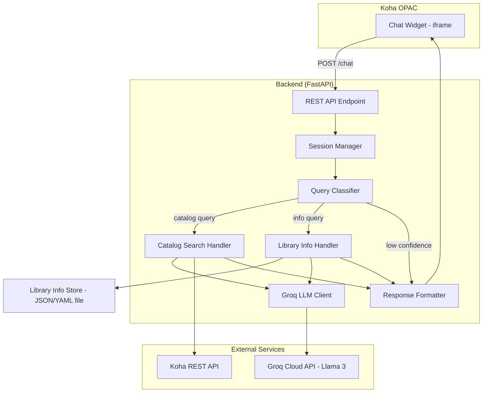

# Design Document: Library AI Chatbot

## Overview

The Library AI Chatbot is a Python-based conversational assistant that integrates with the Koha ILS and Groq Cloud LLM API to help library patrons search the catalog, check book availability, and get answers about library hours, policies, and fines. The system consists of three main layers:

1. A lightweight frontend chat widget embedded in the Koha OPAC via iframe
2. A Python (FastAPI) backend that orchestrates query classification, LLM interaction, and catalog lookups
3. External service integrations with Groq Cloud (Llama 3) and Koha REST API

The backend classifies each patron query as either a catalog search or a library information question, routes it to the appropriate handler, and returns a natural language response. Conversation context is maintained per session to support follow-up questions.

## Architecture



### Request Flow

1. Patron sends a message via the Chat Widget
2. Backend receives the POST request with message + session ID
3. Session Manager retrieves or creates conversation history
4. Query Classifier uses Groq LLM to determine intent (catalog search vs. library info)
5. Request is routed to the appropriate handler
6. Handler gathers data (from Koha API or Library Info Store) and constructs an LLM prompt
7. Groq LLM generates a natural language response
8. Response is returned to the Chat Widget

## Components and Interfaces

### 1. Chat Widget (Frontend)

- Standalone HTML/CSS/JS page served by the backend, embedded in Koha OPAC via iframe
- Provides text input, send button, and scrollable message history
- Communicates with backend via `POST /api/chat`
- Displays connection error state when backend is unreachable
- Responsive layout for desktop and mobile

### 2. REST API Endpoint

**POST /api/chat**

Request:
```json
{
  "message": "Do you have any books by Toni Morrison?",
  "session_id": "abc-123-def"
}
```

Response:
```json
{
  "reply": "I found several books by Toni Morrison...",
  "session_id": "abc-123-def"
}
```

Error (400):
```json
{
  "error": "Message field is required and must be non-empty"
}
```

- Validates request body (non-empty message, valid session_id)
- Returns 400 for invalid requests with descriptive error messages
- Returns JSON responses for all cases

### 3. Session Manager

- Stores conversation history in-memory using a dictionary keyed by session ID
- Each session holds a list of message objects `{role: "user"|"assistant", content: str}`
- Limits history to 20 most recent messages per session
- Expires sessions after 30 minutes of inactivity using a last-accessed timestamp
- Initializes empty history for new sessions
- Runs a periodic cleanup task to purge expired sessions

### 4. Query Classifier

- Sends the patron message (with conversation context) to Groq LLM with a classification prompt
- LLM returns a structured response: `{"intent": "catalog_search"|"library_info"|"unclear", "confidence": float}`
- Routes to catalog search handler, library info handler, or asks a clarifying question based on intent
- Classification prompt is separate from response generation prompt

### 5. Catalog Search Handler

- Receives classified catalog queries
- Uses Groq LLM to extract structured search parameters from natural language:
  ```json
  {"title": "...", "author": "...", "subject": "...", "isbn": "..."}
  ```
- Queries Koha REST API with extracted parameters
- For availability checks, queries item-level availability data
- Groups multi-copy results by branch
- Passes results to Groq LLM for natural language formatting

### 6. Library Info Handler

- Loads library information from the Library Info Store (JSON/YAML file)
- Matches patron query to relevant info sections
- Uses Groq LLM to generate a natural language response from the matched data
- Returns a "contact staff" message when no relevant info is found

### 7. Groq LLM Client

- Wraps all communication with the Groq Cloud API
- Configurable model name (default: Llama 3), max tokens, temperature
- Includes system prompt constraining responses to library topics
- Handles API errors, timeouts, and rate limits
- Returns fallback messages on failure
- Queues requests when rate limited and informs patron of delay

### 8. Library Info Store

- JSON or YAML file at a configurable path (environment variable)
- Contains structured data for hours, policies, and fines
- Editable by library administrators without code changes
- Loaded at startup, optionally reloaded on change

Example structure:
```json
{
  "hours": {
    "monday": "9:00 AM - 8:00 PM",
    "tuesday": "9:00 AM - 8:00 PM",
    "saturday": "10:00 AM - 5:00 PM",
    "sunday": "Closed"
  },
  "policies": {
    "borrowing_limit": "15 items at a time",
    "renewal_rules": "Items may be renewed up to 2 times unless on hold",
    "membership": "Free for all residents with valid ID"
  },
  "fines": {
    "overdue_per_day": "$0.25 per day",
    "lost_item": "Replacement cost + $5.00 processing fee",
    "max_fine": "$10.00 per item"
  }
}
```

## Data Models

### ChatRequest
```python
class ChatRequest(BaseModel):
    message: str          # Non-empty patron message
    session_id: str       # Unique session identifier
```

### ChatResponse
```python
class ChatResponse(BaseModel):
    reply: str            # Chatbot response text
    session_id: str       # Session identifier
```

### ErrorResponse
```python
class ErrorResponse(BaseModel):
    error: str            # Descriptive error message
```

### SessionData
```python
class SessionData:
    messages: list[dict]  # List of {role, content} message dicts
    last_accessed: float  # Timestamp of last activity
    created_at: float     # Timestamp of session creation
```

### ClassificationResult
```python
class ClassificationResult(BaseModel):
    intent: str           # "catalog_search" | "library_info" | "unclear"
    confidence: float     # 0.0 to 1.0
```

### SearchParameters
```python
class SearchParameters(BaseModel):
    title: str | None = None
    author: str | None = None
    subject: str | None = None
    isbn: str | None = None
```

### CatalogRecord
```python
class CatalogRecord(BaseModel):
    title: str
    author: str
    call_number: str | None = None
    isbn: str | None = None
```

### ItemAvailability
```python
class ItemAvailability(BaseModel):
    branch: str
    status: str           # "available" | "checked_out" | "on_hold" | etc.
    call_number: str | None = None
    due_date: str | None = None  # ISO date string if checked out
```

### LibraryInfo
```python
class LibraryInfo(BaseModel):
    hours: dict[str, str]
    policies: dict[str, str]
    fines: dict[str, str]
```

## Correctness Properties

*A property is a characteristic or behavior that should hold true across all valid executions of a system — essentially, a formal statement about what the system should do. Properties serve as the bridge between human-readable specifications and machine-verifiable correctness guarantees.*

### Property 1: Search parameter extraction produces valid structure

*For any* non-empty patron message string, the search parameter extraction function should return a valid `SearchParameters` object where each field is either `None` or a non-empty string, and at least one field is non-`None` when the message contains identifiable search terms.

**Validates: Requirements 1.1**

### Property 2: Catalog result formatting includes required fields

*For any* non-empty list of `CatalogRecord` objects, the formatted response string should contain the title, author, and call number of every record in the list.

**Validates: Requirements 1.3**

### Property 3: Available item response includes location details

*For any* `ItemAvailability` object with status "available", the formatted response should contain the branch name and call number.

**Validates: Requirements 2.2**

### Property 4: Checked-out item response includes due date

*For any* `ItemAvailability` object with status "checked_out" and a non-null `due_date`, the formatted response should contain the due date value.

**Validates: Requirements 2.3**

### Property 5: Multi-copy availability grouped by branch

*For any* list of `ItemAvailability` objects spanning multiple branches, the formatted response should group items by branch such that all items for a given branch appear together contiguously.

**Validates: Requirements 2.4**

### Property 6: Library info retrieval returns relevant data

*For any* category key (hours, policies, or fines) present in the `LibraryInfo` store, querying the library info handler with a question about that category should produce a response containing at least one value from that category's data.

**Validates: Requirements 3.1, 3.2, 3.3**

### Property 7: Query classification returns valid result

*For any* non-empty patron message string, the query classifier should return a `ClassificationResult` with `intent` in `{"catalog_search", "library_info", "unclear"}` and `confidence` between 0.0 and 1.0 inclusive.

**Validates: Requirements 4.1**

### Property 8: Routing matches classification intent

*For any* `ClassificationResult` with intent "catalog_search" or "library_info", the backend should invoke the handler corresponding to that intent — catalog search handler for "catalog_search" and library info handler for "library_info".

**Validates: Requirements 4.2, 4.3**

### Property 9: Session stores all messages

*For any* sequence of messages sent to the same session, the session manager should store every message in order, and retrieving the session history should return all stored messages.

**Validates: Requirements 6.1**

### Property 10: LLM calls include conversation history

*For any* session with at least one prior message, when a new message is processed, the prompt sent to the Groq LLM client should include the prior conversation history messages.

**Validates: Requirements 6.2**

### Property 11: Session history capped at 20 messages

*For any* session, regardless of how many messages are added, the stored conversation history should never contain more than 20 messages. When the cap is exceeded, the oldest messages should be dropped.

**Validates: Requirements 6.4**

### Property 12: New sessions start with empty history

*For any* new session ID that has not been seen before, the session manager should return an empty message list.

**Validates: Requirements 6.5**

### Property 13: System prompt always included in LLM calls

*For any* call to the Groq LLM client, the messages array sent to the API should include a system message constraining the chatbot to library-related topics.

**Validates: Requirements 7.2**

### Property 14: Token limit always set in LLM calls

*For any* call to the Groq LLM client, the request should include a `max_tokens` parameter set to a positive integer.

**Validates: Requirements 7.4**

### Property 15: Invalid requests are rejected with 400

*For any* request to the `/api/chat` endpoint where the message is empty, whitespace-only, or missing, or where the session_id is missing, the backend should return a 400 status code with a JSON body containing an `error` field.

**Validates: Requirements 8.2**

### Property 16: Valid responses contain required JSON fields

*For any* valid request to the `/api/chat` endpoint (non-empty message, valid session_id), the response should be valid JSON containing both a `reply` string field and a `session_id` string field.

**Validates: Requirements 8.4**

### Property 17: Configuration reads from environment variables

*For any* set of environment variable values for `KOHA_API_URL`, `GROQ_API_KEY`, `GROQ_API_URL`, and `LIBRARY_INFO_PATH`, the configuration object should reflect those exact values.

**Validates: Requirements 9.1, 9.2, 9.3**

### Property 18: Missing required environment variable causes startup failure

*For any* required environment variable that is absent, the application startup should raise an error or exit with a non-zero status code, and the error message should name the missing variable.

**Validates: Requirements 9.5**

## Error Handling

### External Service Failures

| Scenario | Behavior |
|---|---|
| Koha API unreachable | Return user-friendly message: "The library catalog is temporarily unavailable. Please try again later." |
| Koha API returns error on availability check | Return: "Availability information is temporarily unavailable." |
| Groq API error or timeout | Return fallback message: "I'm having trouble processing your request right now. Please try again in a moment." |
| Groq API rate limit exceeded | Queue request, respond: "I'm experiencing high demand. Your request will be processed shortly." |

### Input Validation

| Scenario | Behavior |
|---|---|
| Empty or whitespace-only message | Return 400 with `{"error": "Message field is required and must be non-empty"}` |
| Missing session_id | Return 400 with `{"error": "Session identifier is required"}` |
| Malformed JSON body | Return 400 with `{"error": "Invalid request format"}` |

### Session Errors

| Scenario | Behavior |
|---|---|
| Expired session | Transparently create a new session with empty history |
| Session history exceeds 20 messages | Silently drop oldest messages to maintain the 20-message cap |

### Configuration Errors

| Scenario | Behavior |
|---|---|
| Missing required environment variable | Log error naming the missing variable, exit with non-zero status |
| Library Info Store file not found | Log error with file path, exit with non-zero status |
| Library Info Store file is malformed | Log parsing error, exit with non-zero status |

### Graceful Degradation

- If the Groq API is down, the chatbot should still return meaningful error messages rather than crashing
- If the Koha API is down, library info queries should still work (they don't depend on Koha)
- The Chat Widget should detect backend unavailability and show an appropriate message

## Testing Strategy

### Unit Tests

Unit tests cover specific examples, edge cases, and error conditions:

- **Request validation**: Test that empty messages, missing session IDs, and malformed requests return 400
- **Session expiry**: Test that a session inactive for >30 minutes is cleared
- **No search results**: Test that an empty catalog result set produces a "no results found" message
- **Koha API errors**: Test that connection errors produce the correct fallback message
- **Groq API errors**: Test that timeouts and errors produce graceful fallback messages
- **Rate limiting**: Test that rate limit responses trigger queuing behavior
- **Library info not found**: Test that queries with no matching info suggest contacting staff
- **Low-confidence classification**: Test that unclear intent triggers a clarifying question
- **Config missing env var**: Test that each required env var, when missing, causes a startup error
- **Chat Widget error state**: Test that the widget shows an unavailable message when the backend is down

### Property-Based Tests

Property-based tests use the `hypothesis` library (Python) to verify universal properties across randomly generated inputs. Each test runs a minimum of 100 iterations.

Each property test references its design document property using the tag format:

```
# Feature: library-ai-chatbot, Property {N}: {title}
```

Properties to implement as property-based tests:

1. **Property 1** — Search parameter extraction produces valid structure
2. **Property 2** — Catalog result formatting includes required fields
3. **Property 3** — Available item response includes location details
4. **Property 4** — Checked-out item response includes due date
5. **Property 5** — Multi-copy availability grouped by branch
6. **Property 6** — Library info retrieval returns relevant data
7. **Property 7** — Query classification returns valid result
8. **Property 8** — Routing matches classification intent
9. **Property 9** — Session stores all messages
10. **Property 10** — LLM calls include conversation history
11. **Property 11** — Session history capped at 20 messages
12. **Property 12** — New sessions start with empty history
13. **Property 13** — System prompt always included in LLM calls
14. **Property 14** — Token limit always set in LLM calls
15. **Property 15** — Invalid requests are rejected with 400
16. **Property 16** — Valid responses contain required JSON fields
17. **Property 17** — Configuration reads from environment variables
18. **Property 18** — Missing required environment variable causes startup failure

### Testing Libraries

- **pytest** — Test runner
- **hypothesis** — Property-based testing library for Python
- **pytest-asyncio** — Async test support for FastAPI
- **httpx** — Async HTTP client for testing FastAPI endpoints via `TestClient`
- **unittest.mock** — Mocking Groq API and Koha API calls

### Test Organization

```
tests/
  test_session_manager.py      # Properties 9, 10, 11, 12
  test_query_classifier.py     # Properties 7, 8
  test_catalog_handler.py      # Properties 1, 2, 3, 4, 5
  test_library_info_handler.py # Property 6
  test_groq_client.py          # Properties 13, 14
  test_api_endpoint.py         # Properties 15, 16
  test_config.py               # Properties 17, 18
```
